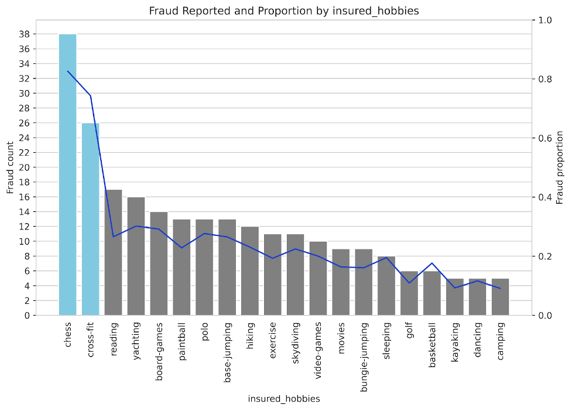

# DSA4263 - Insurance Claim Fraud Detection

## Problem Statement

In the insurance industry, clients normally make annual payments in the hope of getting some monetary claims in case some unexpected events happen such as property destruction, car accidents, as well as heart attacks. 

  

Unfortunately, some of these claims are misused for personal advantage, causing many insurance companies to take more time in manual claim processing as higher due diligence is required. However, some cases may require fast decision making especially when there’s a patient whose condition has become critical and needs some surgery to be done as soon as possible. With manual processing, multiple issues can occur due to this situation, which include:

- Unhappy customers can be caused by the following cases:
    - Death because of not being able to pay for surgery or treatment
    - Lose their house and cars
- Huge loss for the company
- Slow claim processing
- Loss of Productivity due to manual processing

## Project Structure

  

## Dataset

The dataset contains 1000 rows and 40 columns. The columns recorded consist of the clients' details and their respective claims. More details about each column belonging to policy and claims can be found in https://data.mendeley.com/datasets/992mh7dk9y/2 (Aqqad, 2023).

The dataset is sampled from various insurance companies from three US states: South Carolina, Virginia and Albany. Each row represents a single anonymised claim record submitted by the insurance client to the insurance companies. The fraud_reported label is the classification made to decide if this claim is fraudulent or not. There are 200 fraudulent claims present in this dataset and this dataset is imbalanced.

  
  

Since the data’s quality determines the quality of the machine learning output, it suffices to examine this dataset’s acquisition process. Although the dataset does not provide any details about this dataset acquisition, this report will, nonetheless, offer our group’s educated guess on this dataset’s creation based on the existing insurance industry practices in Singapore. Currently, the insurance professionals will perform manual checks on these claims. Before commencing the manual checks, the clients’ policy details and their claims details must be available. The policy details from the customers are retrieved from the latest customers’ database in the insurance companies and updated frequently to reflect their age or changes to their insurance policy portfolio.

From the client's side, they will need to submit their car claims, a PDF and fill in the details about their respective incident via the dropdown button or fill-in-box online. Then, the process of transferring data from this softcopy could be done either with OCR technology or manual data entry by administrative personnel. 

Once this information is available to the insurance professionals, we postulate that there are two rounds of manual checks being conducted to ensure impartiality and fairness for the insurance claims. The first preliminary round of checks is done to check for any anomaly between the profile details and claims details. The second round is to moderate the insurance claim classification to confirm if the insurance claim is correct. The final output for the fraud_label column represents the final decision from the insurance experts.

## Insights

### Incident Exposure Analysis

Firstly, EDA was performed based on the existing literature about fraudster’s modus operandi on exposure theory, whereby the fraudsters seek to maximise their exposure to keep themselves clean under the radar to reduce their chance of getting caught. One set of factors that might have significance in fraud detection was the exposure of the case, i.e., how “well-known” is the incident, to both the authorities and the general public. Hence, investigation into the type of the authorities contacted for fraudulent insurance claims and the number of witnesses present for the insurance claims were performed.

In our dataset, two columns, “witnesses” and “authorities contacted”, represent the exposure of the event in the above dimensions. 

  
  

Based on the visualisations provided above, surprisingly, both types of cases exhibit similar distributions regarding the number of witnesses and the authorities_contacted column. This suggests a potential collusion between fraudsters and members of the public to procure witnesses, and possibly deceitful behaviour towards authorities to manipulate their involvement in the incident. It's plausible that such actions stem from past fraud detection methods that heavily relied on exposure, prompting fraudsters to pay special attention to these aspects and take extra precautions to conceal their actions. Consequently, we hypothesise that the public exposure of an incident may not reliably predict insurance fraud.

### Fraudster Incentive Analysis

Secondly, the report delved into the mindset of the fraudsters’ psychology through fraudster incentive. In the context of fraudulent claims, it is important to ask cui bono? If the fraudster does not benefit from the act, they would not have the incentive to commit insurance fraud in the first place. Therefore, the severity of the incident was scrutinised closely for this second EDA.

  
  

As observed from the visualisations above, the majority of Major Damage reported are fraudulent. This trend is highlighted in particular by the left figure, where the absolute number of fraud cases, as well as the proportion of fraud cases in this class of incident_severity. 
As such, we hypothesise that incident severity could be a significant predictor in fraud detection, where cases reported as Major Damage are more likely to be fraudulent. This presumption is grounded in economic motivations, as fraudsters are more inclined to label their cases as major for the larger insurance payouts. Given the substantial monetary investment and logistical efforts involved in orchestrating fraudulent schemes, fraudsters seek commensurate economic gains to offset their expenses effectively.

### Anomaly Analysis

Lastly, EDA was used to discover anomalies in the dataset. After conducting exhaustive search on all the variables in the dataset, a noticeably large number of insurance claims in which the cilents who indicated “chess' or “cross-fit' under insured_hobbies column are fraudulent as shown in the visualisation below.

  

As correlation does not imply causation, it is preposterous to conclude that insurance clients who declared “chess” and “cross-fit” are more likely to commit fraudulent claims. The high frequencies in the “chess” and “cross-fit” are attributed towards cultural factors and location-driven. Since the dataset used is based in the USA and the culture in the USA is arguably dominantly anglo-saxon, the popularity sentiments towards cross-fit in the USA and chess as part of common pastimes will be reflected in this dataset unsurprisingly.. 

As such, the report made the following three hypotheses. Firstly, the car brand and the insured claimants policy affects the fraudulent claims. Secondly, either exposure theory or fraudster incentive has an influence on the fraudulent claims. Lastly, the hobbies “chess” and “cross-fit” do not contribute to the fraudulent claims outcome.

## Challenges

As the dataset is imbalanced, it may affect the performance of our models. Hence, it is important to use several oversampling strategy as follows:
- SMOTENC: https://imbalanced-learn.org/stable/references/generated/imblearn.over_sampling.SMOTENC.html
- Random Oversampling: https://imbalanced-learn.org/stable/references/generated/imblearn.over_sampling.RandomOverSampler.html
- ADASYN: https://imbalanced-learn.org/stable/references/generated/imblearn.over_sampling.ADASYN.html

Additionally, there may be some features which are not relevant. As there are 40 features in the dataset, each of us in a team of 4 started by analyzing 10 features and see if they are relevant.

## Machine Learning Models Used

We are using several models to build the insurance claim fraud detection system, which include the following:
- Decision Tree: https://scikit-learn.org/stable/modules/tree.html
- Random Forest:https://scikit-learn.org/stable/modules/generated/sklearn.ensemble.RandomForestClassifier.html
- XGBoost: https://xgboost.readthedocs.io/en/stable/
- LightGBM: https://lightgbm.readthedocs.io/en/stable/
- Multi Perceptron Layer: https://scikit-learn.org/stable/modules/generated/sklearn.neural_network.MLPClassifier.html
- SVM: https://scikit-learn.org/stable/modules/svm.html
- Logistic Regression: https://scikit-learn.org/stable/modules/generated/sklearn.linear_model.LogisticRegression.html

For this project, we aim to maximize the F1-Score of the models, as we want to make sure that all of the historical cases are predicted correctly, but at the same time the models can predict correctly as well!

In the end, other than having great performing models, we would also love them to be interpratable as well.

Hence we also show the SHAP visualization based on the feature importance for each model.

This part will allow the business team to understand what factors are likely to be associated with fraudulent cases.

## Conclusion

### Findings

In our EDA, we had three hypotheses that we wanted to test through the model. Firstly, whether the car brand and the insured claimants' policy had an effect on fraudulent claims. Secondly, whether exposure theory or fraudster incentive influenced fraudulent claims. And lastly, that the hobbies “chess” and “cross-fit” do not contribute to the fraudulent claims outcome.

  

The model results reveal some surprising outcomes. To answer the first hypothesis, the car brand and claimant’s policy were insignificant to the fraud prediction outcome according to the SHAP plots. While the feature importance results did not provide us an answer on the significance of exposure theory, fraudster incentive had a definite positive effect on the probability that a claim was fraudulent. Surprisingly, chess and cross fit did in fact have a strong positive effect on fraudulent claims. 

To better understand why this may be, we spoke to a head of motor claims in Malaysia for a major insurance company, hereby referred to as ‘J’. While data on hobbies is not collected at the time of writing a coverage plan, and is not an on the ground factor for traditional fraud such as fake theft of vehicles, it definitely plays a factor when it comes to exaggeration of claims in bodily injury cases. For example, if there is an amputation, the injured person might buy the most expensive prosthetic (eg. bionic), when it is not needed and thus the insurance company would have to investigate and get second opinions. In such a case, hobbies like cross fit are taken into account.

Similarly for major damage, on the ground this isn't seen as significant to fraud, but again it is possible that the results seen in the model describe the exaggeration of claims, where the damage might be minor or moderate but is 'claimed' as major.

### Significance for the industry

The insurance industry in the APAC region is yet to leverage data analytics at its full strength to combat the issue of fraud. Existing AI fraud solutions in the region tend to lack accuracy in detecting fraud, generating high volumes of false alerts[8]. 

In Malaysia, all the major insurance firms use a central system called FIS (Fraud Intelligence System). Once a claim has been registered, users can go into the FIS and look at a plethora of data about a specific vehicle, from previous insurers to claim history. The FIS also provided a score to each claim, and flags claims as suspicious below a certain threshold. This helps investigators focus their attention and reduces claim approval times.

A timeline of a typical motor claim in Malaysia goes like this:
1. The Claim is registered, usually by the mechanic shop.
2. The claims officer goes into FIS and looks up historical data on the vehicle.
3. An on the ground investigation is carried out, and if fraud is suspected external adjusters are hired to determine the company’s true liability.

  
  

Like diagnostic tests for diseases, in fraud detection false negatives need to be minimised, and the LightGBM model reports a strong recall performance of 0.86, despite being hindered by the small dataset. Thus, our model fits into step 2 of the claims process, where it provides even stronger accuracy in detecting fraudulent behaviour and can further optimise claims processing times.

### Limitation and Future Work

The main limitation of this project is in the size of the dataset. Only having 1000 observations means that we cannot catch time series variation, a data point that may help in understanding collusion and syndicates in fraud. Another limitation that we face is the absence of data that claims adjusters currently use to make judgements on claims. This includes visual data such as photos of the accident scene, and when the accident report was filed. Late reporting is a big red flag according to J, especially if it is a multi car collision and the third party reports late as well. 

Future work should focus on testing the model on much larger datasets to assess performance, along with the analysis of visual data. One possible application of machine learning in fraud detection is using OCR to assess surface damage on vehicles. Preliminary results are encouraging, but much more work needs to be done to combat motor insurance fraud.

## References

Chauhan, N. S. (2020, January). Decision tree algorithm, explained. KDnuggets. https://www.kdnuggets.com/2020/01/decision-tree-algorithm-explained.htm 
Imbalanced Learn. (n.d.). SMOTENC. SMOTENC - Version 0.12.2. https://imbalanced-learn.org/stable/references/generated/imblearn.over_sampling.SMOTENC.html 

Chawla, N. V., Bowyer, K. W., Hall, L. O., & Kegelmeyer, W. P. (2002). Smote: Synthetic minority over-sampling technique. SMOTE: Synthetic Minority Over-sampling Technique. https://arxiv.org/pdf/1106.1813.pdf 

Chen, T., & Guestrin, C. (2016, June 10). XGBoost: A scalable tree boosting system. arXiv.org. https://arxiv.org/abs/1603.02754 

Aqqad, A. (2023, September 8). Leveraging machine learning techniques for enhanced detection of insurance fraud claims: An empirical study. SSRN. https://papers.ssrn.com/sol3/papers.cfm?abstract_id=4552815 

He, H., Bai, Y., Garcia, E. A., & Li, S. (2008). Adasyn: Adaptive Synthetic Sampling Approach for Imbalanced Learning | IEEE Conference Publication | IEEE Xplore. ADASYN: Adaptive synthetic sampling approach for imbalanced learning. https://ieeexplore.ieee.org/document/4633969/ 

Batista, G. E. A. P. A., Prati, R. C., & Monard, M. C. (2004, June 1). A study of the behavior of several methods for balancing machine learning training data. https://dl.acm.org/doi/10.1145/1007730.1007735 

Ke, G., Meng, Q., Finley, T., Wang, T., Chen, W., Ma, W., Ye, Q., & Liu, T.-Y. (2017). LightGBM: A highly efficient gradient boosting decision tree. Advances in Neural Information Processing Systems. https://papers.nips.cc/paper_files/paper/2017/hash/6449f44a102fde848669bdd9eb6b76fa-Abstract.html 

Snoek, J., Larochelle, H., & Adams, R. P. (2012, August 29). Practical Bayesian optimization of Machine Learning Algorithms. arXiv.org. https://arxiv.org/abs/1206.2944 

Akiba, T., Sano, S., Yanase, T., Ohta, T., & Koyama, M. (2019, July 25). Optuna: A next-generation hyperparameter optimization framework. arXiv.org. https://arxiv.org/abs/1907.10902 

James, G., Witten, D., Hastie, T., & Tibshirani, R. (2021). An introduction to statistical learning. An Introduction to Statistical Learning. https://www.statlearning.com/ 

Hedges Company. (2024, February 2). How many cars are there in the world? statistics by country. Hedges & Company. https://hedgescompany.com/blog/2021/06/how-many-cars-are-there-in-the-world/ 

CEIC. (2024). Singapore number of registered vehicles. Singapore Number of Registered Vehicles. https://www.ceicdata.com/en/indicator/singapore/number-of-registered-vehicles 

Chen, S., Kuhn, M., Prettner, K., & Bloom, D. E. (2019). The global macroeconomic burden of road injuries: Estimates and projections for 166 countries. The Lancet Planetary Health, 3(9). https://www.thelancet.com/journals/lanplh/article/PIIS2542-5196(19)30170-6/fulltext#seccestitle130 

Cuneo, N., & Singh, G. (2022). Zero touch claims – how P&C insurers can optimize claims processing using AWS AI/ML Services | Amazon Web Services. Zero Touch Claims – How P&C insurers can optimize claims processing using AWS AI/ML services. https://aws.amazon.com/blogs/industries/zero-touch-claims-how-pc-insurers-can-optimize-claims-processing-using-aws-ai-ml-services/ 

Probasco, J. (2024, March 12). Everything you need to know about choosing the right auto insurance. Fortune Recommends. https://fortune.com/recommends/insurance/what-is-auto-insurance/ 

General Insurance Association of Singapore. (2024). Home. Motor Insurance Protects You against Financial Damages or Losses That May Arise from a Motor Accident. https://gia.org.sg/consumers/motor.html 

D., A. (2023). Auto insurance market size worth $1764.9 billion by 2032 - increased auto sales and laws mandating insurance to explode demand. Auto Insurance Market Size Worth $1764.9 Billion by 2032 - Increased Auto Sales and Laws Mandating Insurance to Explode Demand. https://finance.yahoo.com/news/auto-insurance-market-size-worth-210000858.html?guce_referrer=aHR0cHM6Ly93d3cuZ29vZ2xlLmNvbS8&guce_referrer_sig=AQAAAKALQFndpxp6NrwAJ7fx2RL1Ub8wzHIggO-bjg5qa9ldXr4WB1LopZgn07jpxCpU2p_pLiPwym7J_4fxmfGwHr5Pm9wkZuB0cr3_tvsz6i0CrEk58_8do6cPa5MagMMMrlbNGoy3JEKgGPu87vlBkCVR9sSGyJPryx25fek1Azb7&guccounter=2 

GIA. (2018). Motor Insurance Fraud. Motor Insurance Fraud - Protect Yourself from Falling Victim to Fraud. https://gia.org.sg/images/resources/For-Consumers-PDF-file/CASE-2018-motorfraud.pdf 

Aqqad, A. (2023a, August 22). Insurance_claims. Mendeley Data. https://data.mendeley.com/datasets/992mh7dk9y/2 